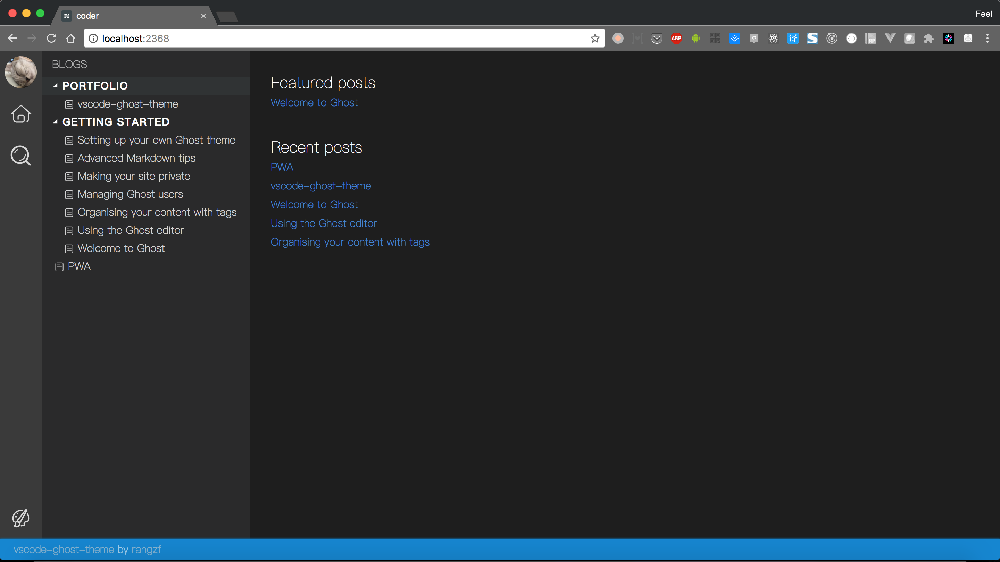
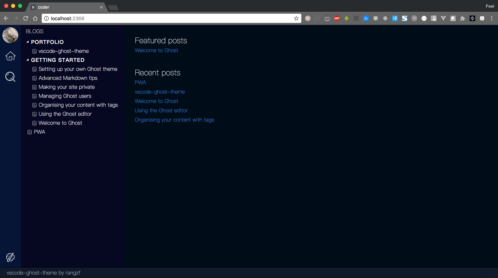
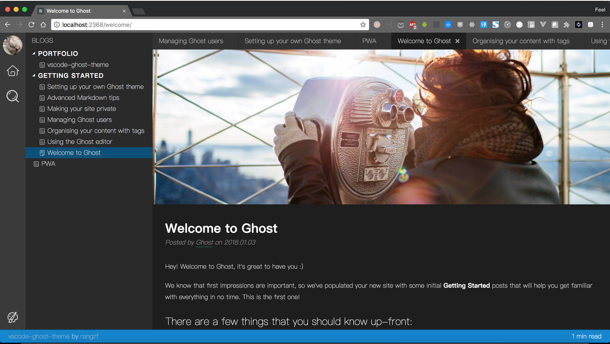
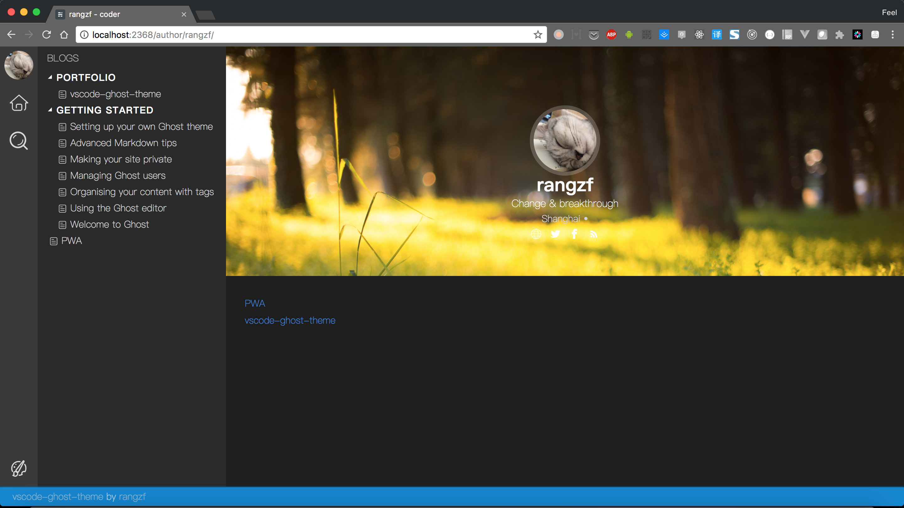
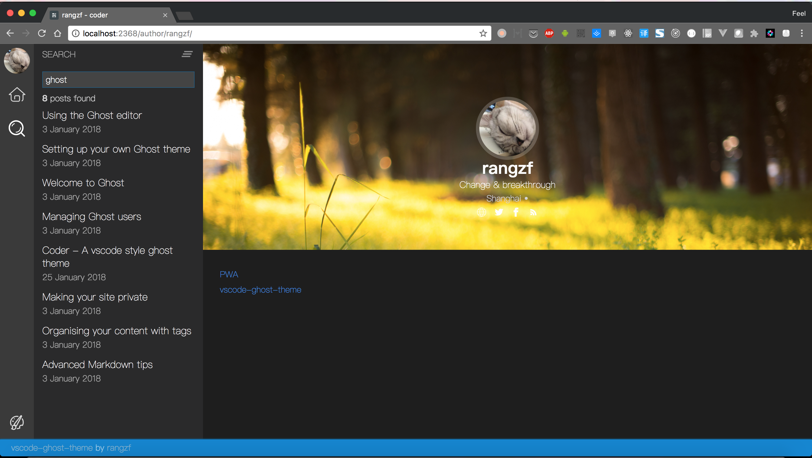

# ghostcode

This is a `vscode-like` Ghost theme, welcome to <b>STAR</b> :) (It's still under development)

## Screenshots

	
Home

	
	
Change to vscode theme 'abyss'

	
	
Post

	
	
Author

	
	
Search

	

## Dev Progress

### P0
- [x] Home page
- [x] Post page
- [x] Author page
- [ ] About page
- [x] ~~Comment System: DISQUS~~(removed due to long loading time)
- [x] ~~Prev / Next post~~(removed to simplify the theme, nav through sidebar is super easy)
- [x] Change theme(Support official `vscode` theme)
- [x] Search all posts
- [x] Responsive(v1, need to optimize)

### P1
- [x] Post Cache
- [ ] Social sharing
- [ ] Reading progress
- [ ] Post Navigation
- [x] Build in Production mode
- [ ] Compatibility testing

## Usage

### Basic
1. Download [ghostcode](https://github.com/rangzf/ghostcode/archive/master.zip) from github
2. Go to admin panel (`{your-domain}/ghost/#/settings/design/uploadtheme`) and drag `ghostcode-master.zip` to upload
3. Chose `active` to make it work

### Advance - Build your own color theme
1. [Download](https://github.com/rangzf/ghostcode/archive/master.zip) and unzip or [clone](https://github.com/rangzf/ghostcode) from github
2. CD to ghostcode theme folder and run `npm install` to install dependencies
3. Get the source code of your favorite [vscode color-theme](https://marketplace.visualstudio.com/search?term=tag%3Acolor-theme&target=VSCode&category=All%20categories&sortBy=Relevance) and download it through:
	1. Theme github page
	2. Install it into/from your vscode, and then find it in your disk (Mac: /Applications/Visual\ Studio\ Code.app/Contents/Resources/app/extensions/theme-*)
4. CD to your theme, usually in the `themes` directory, you can find `.json` file, that's it
5. Copy and put this file into `ghostcode/themes/` folder
6. Regist in `./config.js` `theme` field
7. Then run `npm run theme` command to turn this .json into css style
7. Edit `./default.hbs`, add `theme-{your-theme-name}` to body class, remember to remove the default theme class
8. Zip and upload to your websit

