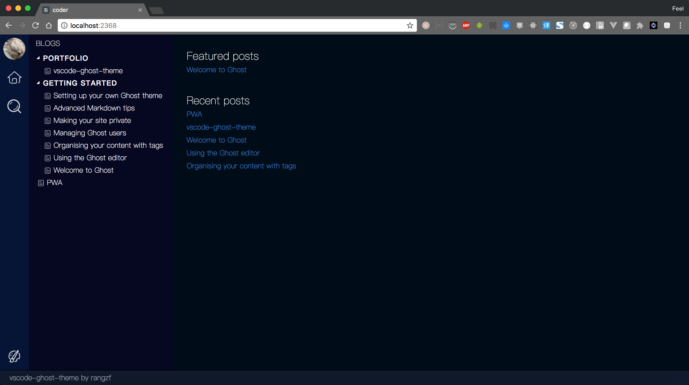

# ghostcode

This is a `vscode-like` Ghost theme (It's still under development)

## Screenshots

	
Home

	
	
Change to vscode theme 'abyss'

	
	
Post

	
	
Author

	
	
Search

	

## Dev Progress

### P0
- [x] Home page
- [x] Post page
- [x] Author page
- [ ] About page
- [x] ~~Comment System: DISQUS~~(removed due to long loading time)
- [x] ~~Prev / Next post~~(removed to simplify the theme, nav through sidebar is super easy)
- [x] Change theme(Support official `vscode` theme)
- [x] Search all posts
- [ ] Responsive

### P1
- [x] Post Cache
- [ ] Social sharing
- [ ] Reading progress
- [ ] Post Navigation
- [ ] Build in Production mode
- [ ] Compatibility testing

