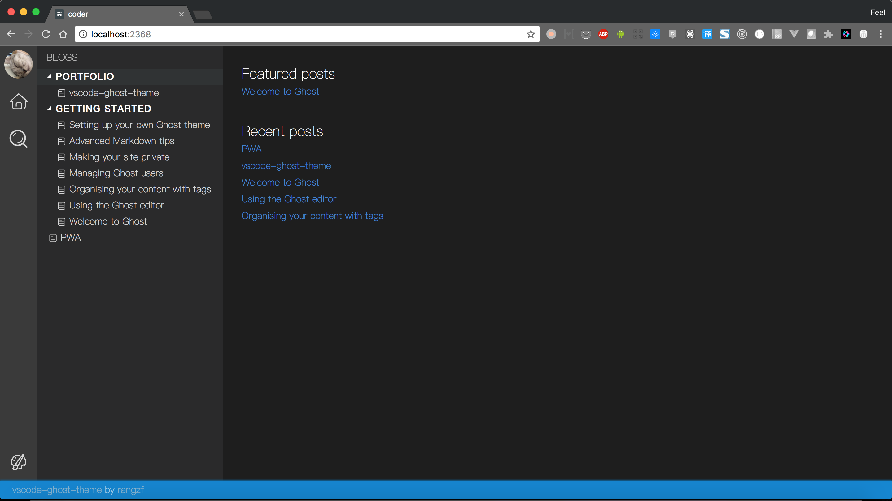
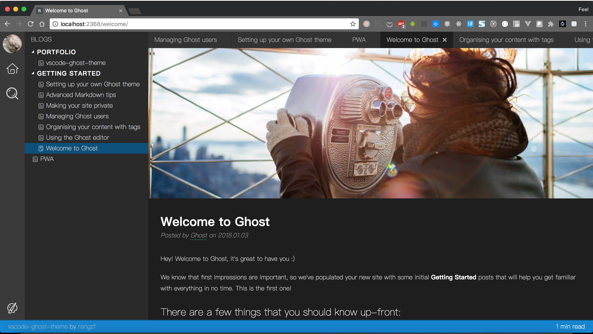
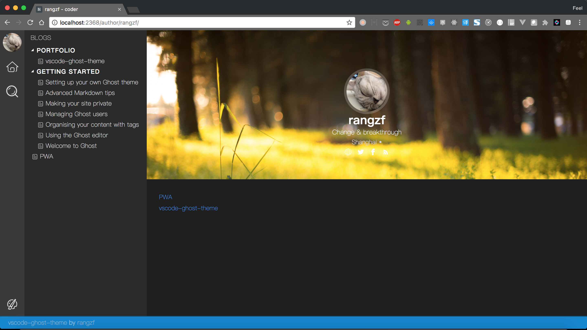
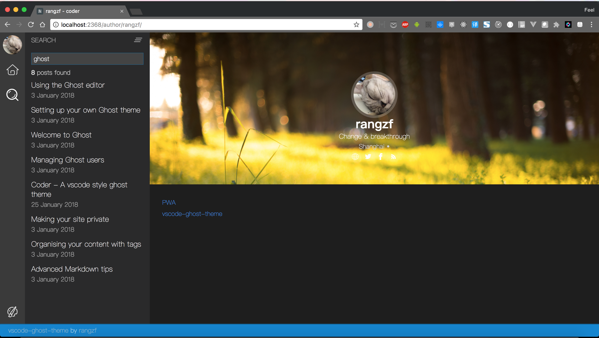

# vscode-ghost-theme

This is a `vscode-like` Ghost theme(it's still under development)

## Screenshots

	
Home

	
	
Post

	
	
Author

	
	
Search

	

## Dev Progress

### P0
- [x] Home page
- [x] Post Page
- [x] Author Page or About Me page
- [x] Comment System: DISQUS
- [x] Prev / Next post
- [x] Change theme(Support official `vscode` theme)
- [x] Search all posts
- [ ] Responsive

### P1
- [x] Post Cache
- [ ] Social sharing
- [ ] Reading progress
- [ ] Post Navigation
- [ ] Build in Production mode
- [ ] Compatibility testing

